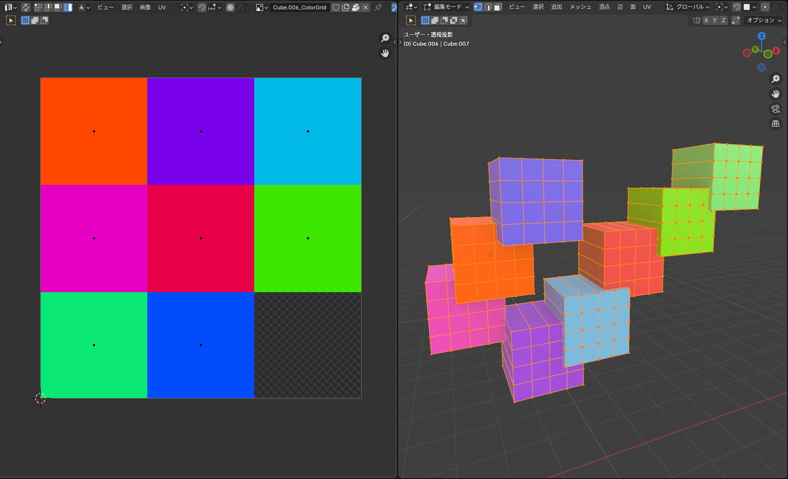

# Material Color Grid Texture

選択した複数オブジェクトのマテリアルのBase Colorを **1枚の共有グリッドテクスチャ** にまとめ、共有マテリアルとして全オブジェクトに割り当てるBlenderアドオンです。メッシュは結合されず分割されたままで、元のマテリアル割り当ては頂点グループとして保存されるので後から面を選び直せます。

主にBlender → Roblox Studio 移行で、テクスチャアセットの枚数を最小化する用途を想定しています。

## できること

選択中のメッシュオブジェクト（複数可）に対して：

1. 全オブジェクトをまたいで各マテリアルの **Principled BSDF → Base Color** を収集し、ユニークな色だけを集約
2. `ceil(√n) × ceil(n/cols)` のグリッドに分割したソリッドカラーのテクスチャを **1枚だけ** 生成（例：4色 → 2×2、10色 → 4×3で2マス空き）
3. そのテクスチャを使う共有マテリアルを作成し、選択した全オブジェクトに割り当て（**ジオメトリは結合しない＝メッシュは分割されたまま**）
4. オプションで各オブジェクトに新しいUVマップ（`ColorGridUV`）を作成し、各面を元のマテリアルの色セルにマッピング。既存のUVマップは全て削除されます
5. オプションで元のマテリアル名と同じ名前の頂点グループを各オブジェクトに作成し、そのマテリアルが使われていた面の頂点を登録（`選択 → 頂点グループ` で後から再選択可能）

色は linear → sRGB エンコードしてから書き込んでいるので、新しいシェーダーでサンプルした色が元のBase Colorと完全に一致します。

## インストール

1. `material_color_grid.py` をダウンロード（またはこのリポジトリをzipで取得）
2. Blender で `編集 → プリファレンス → アドオン → インストール...`
3. `.py` ファイルを選んで、チェックボックスを有効化

Blender 3.x / 4.x で動作確認しています。

## 使い方

1. 色をまとめたいメッシュオブジェクトを **複数選択**（1つでも可）
2. `オブジェクト` メニュー → **Material Color Grid Texture**、または `F3` で検索して実行
3. 左下のやり直しパネル（Redoパネル）でオプション調整：
   - **Resolution** — テクスチャの解像度（正方形）
   - **Create Vertex Groups** — 元のマテリアル名で頂点グループを作成
   - **Remap UVs to Color Cells** — UVマップを置き換えて、各面を対応する色セルに飛ばす
   - **Replace Material Slots** — 既存のマテリアルスロットを全削除して共有マテリアルだけにする

## 補足

- 生成物は `SharedColorGrid`（テクスチャ）と `SharedColorGridMat`（マテリアル）の固定名です。2回実行すると上書きされるので、別グループで残したい場合は先にリネームしてください。
- 同じマテリアルが複数オブジェクト・複数スロットで使われていても1つの色セルにまとめられます。
- Principled BSDFが無いマテリアルはビューポートのdiffuse colorにフォールバックします。
- リンク複製（同じメッシュデータを共有するオブジェクト）は二重処理されないようガードしています。
- 生成された画像は .blend にパックされます。外部ファイルとして必要なら `画像 → 名前を付けて保存` で書き出してください。
- 頂点グループはウェイト1.0で登録されます。マテリアル境界上の頂点は複数のグループに属します。

## ライセンス

MIT — 詳細は [LICENSE](LICENSE) を参照
